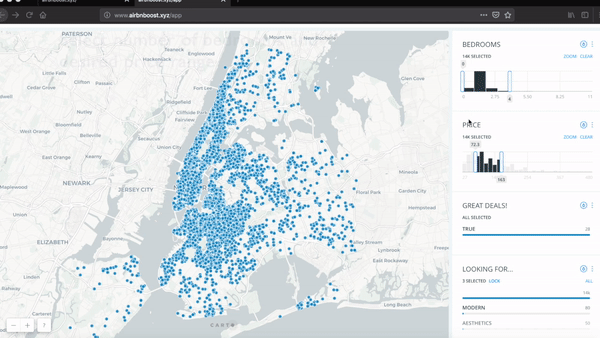

# AirbnBoost
[AirbnBoost](http://www.airbnboost.xyz) is a machine learning-powerd platform that enables users to make faster and better informed Airbnb decisions.

## Features
- See how each listing is priced compared to similar listings based on AirbnBoost's price prediction algorithm.
- Select listings that match your preferences without the need to read through full descriptions. 
- Quantify the urban environment surrounding a listing, such as proximity to subway or neighborhood noise levels.

## Tutorial

